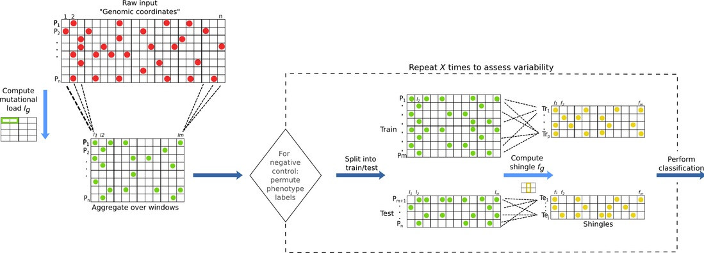

# ReVeaL

ReVeaL, _Rare Variant Learning_, is a stochastic regularization-based learning algorithm. It partitions the genome into non-overlapping, possibly non-contiguous, windows (_w_) and then aggregates samples into possibly overlapping subsets, using subsampling with replacement (stochastic), giving units called shingles that are utilized by a statistical learning algorithm. Each shingle captures a distribution of the mutational load (the number of mutations in the window _w_ of a given sample), and the first four moments are used as an approximation of the distribution.



# Usage
Here a basic command line example

`python3 ReVeaL.py -s sample_info.tsv -l labels.csv -nf 10 -tt train_test.csv -w 50000 -r regions.tsv -o output_folder`

for a full description of the option, please run:

`python3 ReVeaL.py --help`

# Citation

Please cite the following article if you use ReVeaL:

Parida L, Haferlach C, Rhrissorrakrai K, Utro F, Levovitz C, Kern W, et al. (2019) Dark-matter matters: Discriminating subtle blood cancers using the darkest DNA. PLoS Comput Biol 15(8): e1007332. https://doi.org/10.1371/journal.pcbi.1007332

## Dependencies
All dependencies are listed in the [requirements](requirements.txt) file. 

```
pip install -r requirements.txt
```

# Input file and formats

The sample_info.tsv file is a tab separated file contaning in each row: the sample id, chromosome, the alteration start and stop coordinates.

Example:

```
samples chr  start stop
sample_1 1 20  21
sample_1  2 2 10
sample_2  1 5 10
```

The labels.csv is a comma separated file containing in each row the phenotype of the samples.

Example

```
samples, phenotype
sample_1, CASE
sample_2, CONTROL
sample_3, CASE2
```

The train_test.csv is a comma separated file containing for each phenotype the number of shingle wanted to generate for the train and test

Example

```
phenotype, Train, Test
CASE, 10, 5 
CASE2, 10, 5 
CONTROL, 10, 5
```
The regions.tsv is a tab separeted file containg the region of interest. Regions for GRCh38.p14 are reported in the regions folder.

Example

```
chr start stop
1 0 224999719
2 0 237712649
```

